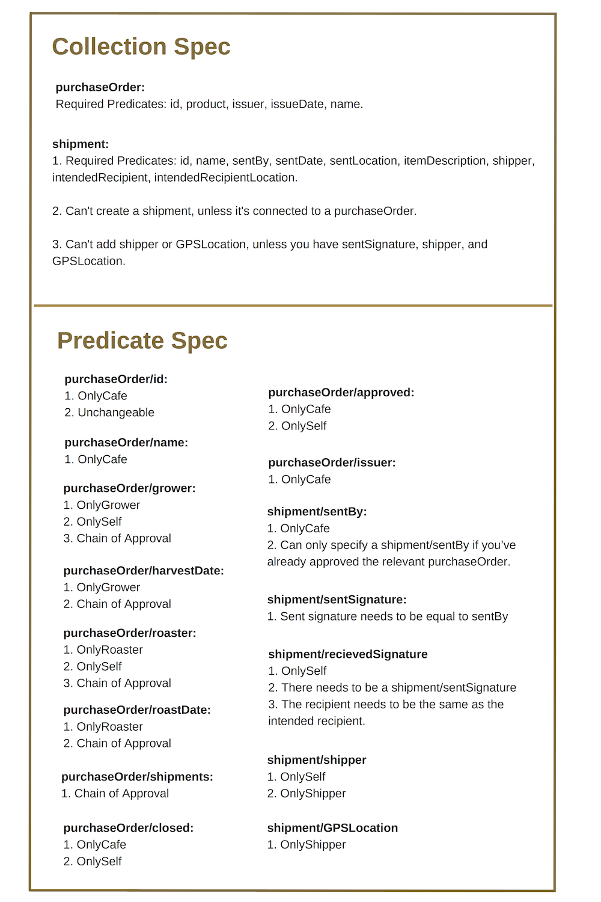
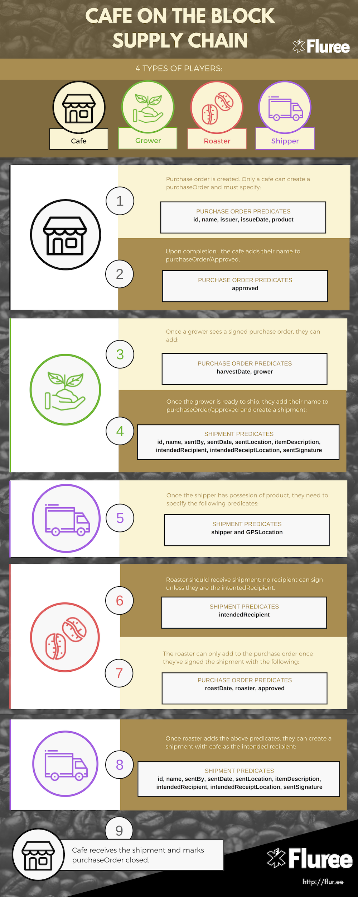

## Supply Chain

In this example, we’ll walk through setting up a custom blockchain for Cafe on the Block, a fictional coffee company that guarantees sustainably-sourced coffee to its customers. This example is highly detailed, and only recommended for those who have a good grasp on creating schemas, issuing transactions, and writing smart functions. If not, we recommend working through the lessons through "Intermediate: Smart Functions."

## Create a Schema
Our first step will be to create collections and predicates. We will be creating purchaseOrder, organization, shipment, product, and event collections, as well as accompanying predicates.

At this point, we will not add any smart functions to the schema; that comes later according to Fluree best practices.

1. The schema transaction is in `Block-02-Schema.js`.
     
The purchaseOrder will become the central collection in our database. Coffee on the Block will create a purchaseOrder, and every other participant in the blockchain will update that purchaseOrder as the product moves through the supply chain. Participants will add shipping information and information about any other events that happen. Before each participant in the supply chain ships the product to the next participant, they will sign off on the purchaseOrder, as a way of approving their portion of the supply chain was successfully completed.

## Add Sample Data
After creating a schema, you should add in your sample data or initial data. 

2. The sample data transaction is in `Block-03-SampleData.js`.

In block 3, we add in four different organizations, and connect each of those organizations to auth records with root access.

Coffee on The Block, a cafe
Ship Shape, a shipper
McDonald’s Farm, a grower
The Roastery, a coffee roaster
Before we do this, however, we'll create 4 public-private key/auth id triples. For the example, you can use the below triples, but in production, you'll want to generate your own.

You can see all the credentials is `credentials.txt`.

## Adding Smart Functions

In these blocks, we add a series of smart functions to collections and predicates. Smart functions can be attached to particular predicates or collections. When a transaction involving any of those particular predicates or collections is issued, the relevant smart functions are triggered. Smart functions then return a truthy or a falsey (nil or boolean false) value. If every triggered smart function returns truthy, then the transaction goes through. Otherwise, it is rejected.

First, we need to create smart functions in the _fn collection, and then we need connect those functions to the _collection/spec or _predicate/spec predicate of a particular collection or predicate. All of the smart functions that we add in these blocks are laid out in the table below. There are several smart Functions that appear throughout the schema that we explain below, in the table, we refer to them by a short name:

- Chain of Approval: If no one has approved the purchaseOrder, a cafe can make updates to particular predicates. If a cafe has approved the purchaseOrder, a grower can make updates to those predicates. If both a cafe and a grower have made updates, a roaster can make updates to those predicates.

- Required Predicates: Certain predicates are required for particular collections.

- OnlyCafe, OnlyGrower, OnlyRoaster, OnlyShipper: Only a cafe, grower, roaster, or shipper, respectively, can create or edit a certain predicates.

- OnlySelf: You can only add a value if your auth is connected to that organization.

The smart functions in this example can be issued in five separate transactions, which we go over below can be found in full in the files corresponding to  Block 4, Block 5, Block 6, Block 7, Block 8.

Below is an overview of all the smart functions that we will be adding.



[Long description of table in link](https://docs.google.com/document/d/1gfZhzRUjWsAXuc3-n7xe_5wvK3xIcFjJuDyGbfd0T5A/edit?usp=sharing)

These rules are vital in a decentralized application where there isn’t necessarily full trust between the actors. A mentioned earlier, setting up and testing these smart functions is part of the initial configuration before a decentralized network goes live. Most applications will not require any changes to the smart functions after initial set up.

The custom blockchain should live at the bottom of a software stack, where the top-level, the user interface, allows for easy and seamless interaction with the database. A good user interface should only allow valid transaction, however the role of the smart functions is to prevent bad actors from circumventing the allowed actions in a database. Even if bad actors were to start issuing transactions directly to a database, they would be unable to issue any transactions that are not allowed by smart functions.

We'll be walking through them more slowly for clarity's sake. Currently, these are only available to be viewed in FlureeQL in our documentation.

### Block 4 Smart Functions
All of the below smart functions are found in Block 4. In this block, we are adding functions to the _fn collection; we are not yet adding them to particular predicates or collections.

#### Required
The first smart function that we create is required. Required can be added to a given collection spec and takes a single parameter - "predicate".

```
[{
    "_id": "_fn$required",
    "name": "required",
    "params": ["predicate"],
    "code": "(boolean (get (query (str \"{\\\"select\\\": [\\\"*\\\"], \\\"from\\\": \" (?sid) \"}\")) predicate))",
    "doc": "This predicate is required. Add to collection spec"
}]
```

Later on in this example, we will be adding required to purchaseOrder and require the predicate purchaseOrder/id. In order to do this, we wouldd attached a function, `(required \"purchaseOrder/id\")`, to the _collection/spec for purchaseOrder.

With this smart function, every time a transaction contains the purchaseOrder collection, the following code will run `(boolean (get (query (str \"{\\\"select\\\": [\\\"*\\\"], \\\"from\\\": \" (?sid) \"}\")) predicate))` with purchaseOrder/id instead of "predicate":

```
(boolean (get (query (str \"{\\\"select\\\": [\\\"*\\\"], \\\"from\\\": \" (?sid) \"}\")) \"purchaseOrder/id\"))
```

The code in required first selects * from the subject, `(query(str \"{\\\"select\\\": [\\\"*\\\"], \\\"from\\\": \" (?sid) \"}\")))`, then attempts to get the predicate in question. If get returns nil, boolean will coerce the result to false, and this will stop the transaction from going through. Else, boolean will return true, and the transaction will go through.

#### New?
This smart function, new? checks if the previous value of something was nil. If that predicate is required, that means that the value is new.

```
[{
    "_id": "_fn$new?",
    "name": "new?",
    "code": "(nil? (?pO))",
    "doc": "Checks whether previous value was nil."
}]
```

#### Auth Organization Type
This function looks up the organization type of the auth issuing a given transaction. (?auth_id) is the _id of the auth issuing a given transaction.

```
[{
    "_id": "_fn$authOrganizationType",
    "name": "authOrganizationType", 
    "code": "(query (str \"{ \\\"select\\\": [{\\\"organization/_auth\\\": [{ \\\"organization/type\\\": [\\\"_tag/id\\\"]}]}], \\\"from\\\": \" (?auth_id) \"}\"))"
}]
```

The following code `(query (str \"{ \\\"select\\\": [{\\\"organization/_auth\\\": [{ \\\"organization/type\\\": [\\\"_tag/id\\\"]}]}], \\\"from\\\": \" (?auth_id) \"}\")) ` translates to the following query:

```
{
    "select": [{"organization/_auth": [{"organization/type": ["_tag/id"]}]}],
    "from": [AUTH ID ISSUING THE TRANSACTION]
}
```

#### Organization Type
This function looks up the organization type of the organization being transacted on.

```
[{
    "_id": "_fn$organizationType",
    "name": "organizationType", 
    "code": "(query (str \"{\\\"select\\\": [{\\\"organization/type\\\": [\\\"_tag/id\\\"]}], \\\"from\\\": \" (?o) \"}\"))"
}]
```

The following code `(query (str \"{\\\"select\\\": [{\\\"organization/type\\\": [\\\"_tag/id\\\"]}], \\\"from\\\": \" (?o) \"}\"))` translates to the following query:

```
{
    "select": [{"organization/type": ["_tag/id"]}],
    "from": [ORGANIZATION _ID BEING TRANSACTED ON]
}
```

#### Organization Auth
This function looks up the organization auth of the organization being transacted on.

```
[{
    "_id": "_fn$organizationAuth",
    "name": "organizationAuth", 
    "code": "(query (str \"{\\\"select\\\": [{\\\"organization/auth\\\": [\\\"_id\\\"]}], \\\"from\\\": \" (?o) \"}\"))"
}]
```

The following code `(query (str \"{\\\"select\\\": [{\\\"organization/type\\\": [\\\"_id\\\"]}], \\\"from\\\": \" (?o) \"}\"))` translates to the following query:

```
{
    "select": [{"organization/auth": ["_id"]}],
    "from": [ORGANIZATION _ID BEING TRANSACTED ON]
}
```

#### Purchase Orders Approved Via Shipment
The following smart function will follow the shipment being transacted on and retrieve information about all organization that approved the purchase order connected to the shipment.

```
[{
    "_id": "_fn$shipmentPOApproved",
    "name": "shipmentPOApproved",
    "code": "(get-all (query (str \"{\\\"select\\\": [{\\\"purchaseOrder/_shipments\\\": [{\\\"purchaseOrder/approved\\\": [\\\"_id\\\"]}]}], \\\"from\\\": \" (?sid) \"}\")) [\"purchaseOrder/_shipments\" \"purchaseOrder/approved\" \"_id\"])",
    "doc": "Gets all of the PO approved from the PO a shipment is connected to."
}]
```

This code `(query (str \"{\\\"select\\\": [{\\\"purchaseOrder/_shipments\\\": [{\\\"purchaseOrder/approved\\\": [\\\"_id\\\"]}]}], \\\"from\\\": \" (?sid) \"}\"))` translates to the query:

```
{
    "select": [{"purchaseOrder/_shipments": [{"purchaseOrder/approved": ["_id"]}]],
    "from": [SUBJECT BEING TRANSACTED ON]
}
```

We then get all of the _id of the organizations who have approved this purchase order.

#### Approved Organization Types
From a purchaseOrder, this smart function will get all the organizations that have approved a given purchase order, and returns the organization/type.

```
[{
    "_id": "_fn$approvedOrgTypes",
    "name": "approvedOrgTypes",
    "code": "(get-all (query (str \"{\\\"select\\\": [{\\\"purchaseOrder/approved\\\": [{\\\"organization/type\\\": [\\\"_tag/id\\\"]}]}], \\\"from\\\":\" (?sid) \"}\")) [\"purchaseOrder/approved\" \"organization/type\" \"_tag/id\"])"
}]
```
This code `(query (str \"{\\\"select\\\": [{\\\"purchaseOrder/approved\\\": [{\\\"organization/type\\\": [\\\"_tag/id\\\"]}]}], \\\"from\\\":\" (?sid) \"}\"))` translates to the following query:

```
{
    "select": [{"purchaseOrder/approved": [{"organization/type": ["_tag/id"]}]}],
    "from": [SUBJECT BEING TRANSACTED ON]
}
```

We then get all of the organization/types of the organizations who have approved this purchase order.

#### Shipment Connected to PO?
This smart function checks whether a shipment is connected to a purchaseOrder.

```
[{
    "_id": "_fn$shipmentConnectedToPO?",
    "name": "shipmentConnectedToPO?",
    "code": "(boolean (get-all (query (str \"{\\\"select\\\": [{\\\"purchaseOrder/_shipments\\\": [\\\"*\\\"]}], \\\"from\\\":\" (?sid) \"}\")) [\"purchaseOrder/_shipments\" \"_id\"]))"
}]
```
The code `(query (str \"{\\\"select\\\": [{\\\"purchaseOrder/_shipments\\\": [\"*\"]}], \\\"from\\\":\" (?sid) \"}\"))` translates to the query:

```
{
    "select": [{"purchaseOrder/_shipments": ["*"]}],
    "from": [SUBJECT BEING TRANSACTED ON]
}
```
Then the get-all function pulls out the _ids for any purchase orders. If there are no purchase orders, get-all will return nil. boolean coerces the result to a true or false.

#### Shipment Sent By and Sent Signature
The following function gets the _id of the organization that sent a shipment.

```
[{
    "_id": "_fn$shipmentSentBy",
    "name": "shipmentSentBy",
    "code": "(get-all (query (str \"{\\\"select\\\": [{\\\"shipment/sentBy\\\": [\\\"_id\\\"]}], \\\"from\\\":\" (?sid) \"}\")) [\"shipment/sentBy\" \"_id\"])",
    "doc": "Gets shipment/sentBy."
}]
``` 

The following function gets the _id of the organization that signed that they sent a shipment.

```
[{
    "_id": "_fn$shipmentSentSignature",
    "name": "shipmentSentSignature",
    "code": "(get-all (query (str \"{\\\"select\\\": [{\\\"shipment/sentSignature\\\": [\\\"_id\\\"]}], \\\"from\\\":\" (?sid) \"}\")) [\"shipment/sentSignature\" \"_id\"])",
    "doc": "Gets shipment/signature."
}]
```

The following function gets the _id of the organization that signed that they received a shipment.

```
[{
    "_id": "_fn$shipmentReceivedSignature",
    "name": "shipmentReceivedSignature",
    "code": "(get-all (query (str \"{\\\"select\\\": [{\\\"shipment/receivedSignature\\\": [\"_id\"]}], \\\"from\\\":\" (?sid) \"}\")) [\"shipment/receivedSignature\" \"_id\"])",
    "doc": "Gets shipment/receivedSignature."
}]
```

The following function gets the _id of the organization that was the intended recipient of the shipment.

```
[{
    "_id": "_fn$shipmentIntendedRecipient",
    "name": "shipmentIntendedRecipient",
    "code": "(get-all (query (str \"{\\\"select\\\": [{\\\"shipment/intendedRecipient\\\": [\"_id\"]}], \\\"from\\\":\" (?sid) \"}\")) [\"shipment/intendedRecipient\" \"_id\"])",
    "doc": "Gets shipment/intendedRecipient."
}]
```

#### Does Subject Contain Predicates?
The following smart functions, checks if a given subject contains a particular predicate.

For the first one, we check if a shipment contains a shipment/sentSignature.

```
[{
    "_id": "_fn$sentSignature?",
    "name": "sentSignature?",
    "code": "(boolean (shipmentSentSignature))"
}]
```

For the next ones, we check use the required function to check if a shipment contains a shipment/GPSLocation and shipment/shipper, respectively.

```
[{
    "_id": "_fn$GPSLocation?",
    "name": "GPSLocation?",
    "code": "(required \"shipment/GPSLocation\")"
}]
[{
    "_id": "_fn$shipper?",
    "name": "shipper?",
    "code": "(required \"shipment/shipper\")"
}]
```

#### Purchase Order Received Signature Auth
The following smart function retrieves all the auth records, who have signed that they received a given purchase order.

```
[{
    "_id": "_fn$purchaseOrderReceivedSignaturesAuth",
    "name": "purchaseOrderReceivedSignaturesAuth",
    "code": "(get-all (query (str \"{\\\"select\\\": [{\\\"purchaseOrder/shipments\\\": [{\"shipment/receivedSignature\": [{\"organization/auth\": [\"_id\"]}]}]}], \\\"from\\\":\" (?sid) \"}\")) [\"purchaseOrder/shipments\" \"shipment/receivedSignature\" \"organization/auth\" \"_id\"]))",
    "doc": "Gets all the auth records from the receivedSignatures from purchaseOrder/shipments."
}]
```

### Block 5 Smart Functions
All of the below smart functions are found in Block 5. In this block, we are continuing to add functions to the _fn collection; we are still not adding functions to particular predicates or collections.

In block 5, unlike in block 4, we can use some of the functions that we created in block 4.

#### Retrieve Data With Get All
The following smart function use the get-all function to retreive information from inside of maps, such as from authOrganizationType or organizationType. These functions build on top of the smart functions we created in block 4.

```
[{
    "_id": "_fn$authOrgType",
    "name": "authOrgType",
    "code": "(get-all (authOrganizationType) [\"organization/_auth\" \"organization/type\" \"_tag/id\"])"
},
{
    "_id": "_fn$orgType",
    "name": "orgType",
    "code": "(get-all (organizationType) [\"organization/type\" \"_tag/id\"])"
},
{
    "_id": "_fn$orgAuth",
    "name": "orgAuth",
    "code": "(get-all (organizationAuth) [\"organization/auth\" \"_id\"])"
}]
```

#### Who Approved the PO?
Each of the below smart functions returns true or false, depending on if the organization that approved a given purchase order is a certain type of organization. These smart functions build on the approvedOrgType smart function we created in block 4.

```
[{
    "_id": "_fn$senderApprovedPO",
    "name": "senderApprovedPO",
    "code": "(contains? (shipmentPOApproved) (shipmentSentBy))"
},
{
    "_id": "_fn$cafeApprovedPO?",
    "name": "cafeApprovedPO?",
    "code": "(contains? (approvedOrgTypes) \"organization/type:cafe\")"
},
{
    "_id": "_fn$growerApprovedPO?",
    "name": "growerApprovedPO?",
    "code": "(contains? (approvedOrgTypes) \"organization/type:grower\")"
},
{
    "_id": "_fn$roasterApprovedPO?",
    "name": "roasterApprovedPO?",
    "code": "(contains? (approvedOrgTypes) \"organization/type:roaster\")"
}]
```

#### Did This Auth Approve the Purchase Order?
The below smart function checks whether the auth record issuing a given transaction is listed as having received any of the shipments connected to that purchase order.

```
[{
    "_id": "_fn$receivedSignatureIsSelf",
    "name": "didAuthRecieveShipment?",
    "code": "(contains? (purchaseOrderReceivedSignaturesAuth) (?auth_id))"
}]
```

### Block 6 Smart Functions
All of the below smart functions are found in Block 5. In this block, we continue to add functions to the _fn collection; we are not yet adding them to particular predicates or collections.

This block in particular is focused on adding functions that either verify the identity of the current auth record issuing a transaction or of the type of organization listed.

#### Auth is Type?
The following smart functions check whether the auth issuing a given transaction is a grower, roaster, cafe, or shipper, respectively.

```
[{
    "_id": "_fn$authIsGrower?",
    "name": "authIsGrower?",
    "code": "(contains? (authOrgType) \"organization/type:grower\")",
    "doc": "Returns true if issuing auth record is connected to a organization of type grower."
},
{
    "_id": "_fn$authIsRoaster?",
    "name": "authIsRoaster?",
    "code": "(contains? (authOrgType) \"organization/type:roaster\")",
    "doc": "Returns true if issuing auth record is connected to a organization of type roaster"
},
{
    "_id": "_fn$authIsCafe?",
    "name": "authIsCafe?",
    "code": "(contains? (authOrgType) \"organization/type:cafe\")",
    "doc": "Returns true if issuing auth record is connected to a organization of type cafe."
},
{
    "_id": "_fn$authIsShipper?",
    "name": "authIsShipper?",
    "code": "(contains? (authOrgType) \"organization/type:shipper\")",
    "doc": "Returns true if issuing auth record is connected to a organization of type shipper."
}]
```

#### Org is Type?
The following smart functions check if the object listed is an organization of a certaion type. For example, isRoaster? will be attached to the predicate purchaseOrder/roaster, because only an organization that is a roaster should be listed in that field.

```
[{
    "_id": "_fn$isGrower?",
    "name": "isGrower?",
    "code": "(contains? (orgType) \"organization/type:grower\")",
    "doc": "Returns true if object is an organization of type grower."
},
{
    "_id": "_fn$isRoaster?",
    "name": "isRoaster?",
    "code": "(contains? (orgType) \"organization/type:roaster\")",
    "doc": "Returns true if object is an organization of type roaster"
},
{
    "_id": "_fn$isCafe?",
    "name": "isCafe",
    "code": "(contains? (orgType) \"organization/type:cafe\")",
    "doc": "Returns true if object is an organization of type cafe."
},
{
    "_id": "_fn$isShipper?",
    "name": "isShipper",
    "code": "(contains? (orgType) \"organization/type:shipper\")",
    "doc": "Returns true if object is an organization of type shipper."
}]
```

#### Org is Self?
This smart function checks whether the auth record issuing a given transaction is connected to the organization that is being put as the value for a given field. For example, we will attach orgAuthIsSelf? to the predicate shipment/receivedSignature, because only an auth record connected to a given organization shoud be allowed to assert that the shipment was received by that organization.

```
[{
    "_id": "_fn$orgAuthIsSelf?",
    "name": "orgAuthIsSelf?",
    "code": "(contains? (orgAuth) (?auth_id))"
}]
```

### Block 7 Smart Functions
All of the below smart functions are found in Block 4. In this block, we are adding functions to the _fn collection; we are not yet adding them to particular predicates or collections.

#### Required Predicates
The following two smart functions will be added to the purchase order and shipment _collection/specs to require certain predicates.

```
[{
    "_id": "_fn$purchaseOrderPredsReq",
    "name": "purchaseOrderPredsReq",
    "code": "(and (required \"purchaseOrder/id\") (required \"purchaseOrder/product\") (required \"purchaseOrder/issuer\") (required \"purchaseOrder/issueDate\") (required \"purchaseOrder/name\"))",
    "doc": "Required predicates: id, product, issuer, issueDate, name."
},
{
    "_id": "_fn$shipmentPredsReq",
    "name": "shipmentPredsReq",
    "code": "(and (required \"shipment/id\") (required \"shipment/name\") (required \"shipment/sentBy\")  (required \"shipment/sentDate\") (required \"shipment/sentLocation\") (required \"shipment/itemDescription\") (required \"shipment/sentSignature\") (required \"shipment/intendedRecipient\") (required \"shipment/intendedReceiptLocation\"))",
    "doc": "Required shipment predicates: id, name, sentBy, sentDate, sentLocaation, itemDescription, intendedRecipient, intendedReceiptLocation."
}]
```

#### Only Cafe Can Create
This smart function will be connected to the purchaseOrder/id predicate. A purchase order's id can only be set by a cafe, and once it is set, it cannot be changed.

The smart function asks if purchaseOrder/id is a newly-set predicate-object pair. If it is new, the smart function will return true if a cafe is attempting to issue a transaction.

If the purchaseOrder/id has a previous value, then the smart function will always return false, no matter who is issuing the transaction.

```
[{
    "_id": "_fn$onlyCafeCreate",
    "name": "onlyCafeCreate",
    "code": "(and (new?) (authIsCafe?))",
    "doc": "When creating a new purchaseOrder, if the auth record is connected to a cafe, allow, else return false."
}]
```

#### Certain Fields Match
The below smart functions check that certain fields match each other, namely that shipment/sentBy is equivalent to shipment/sentSignature, and that shipment/intendedRecipient is equal to shipment/receivedSignature.

```
[{
    "_id": "_fn$sentSignatureEqualsSentBy",
    "name": "sentSignatureEqualsSentBy",
    "code": "(== (shipmentSentBy) (shipmentSentSignature))",
    "doc": "shipment/sentSignature has to be same person as shipment/sentBy"
},
{
    "_id": "_fn$recipientIsIntended",
    "name": "recipientIsIntended",
    "code": "(== (shipmentIntendedRecipient) (shipmentReceivedSignature))",
    "doc": "shipment/intendedRecipient has to be same person as shipment/receivedSignature."
}]
```

#### Certain Predicates Required Together
The below smart function will be added to the shipment collection. If shipment/GPSLocation or shipment/shipper are added to a shipment, you must have a shipment/sentSignature, shipment/GPSLocation, and shipment/sentSignature all need to be present.

```
[{
    "_id": "_fn$shipperGPSRequiredTogether",
    "name": "shipperGPSRequiredTogether",
    "code": "(if-else (or (GPSLocation?) (shipper?)) (and (sentSignature?) (GPSLocation?) (shipper?)) true)"
}]
```

#### Establish Chain of Approval
The chain of approval is as followers: If no one has approved the purchaseOrder, a cafe can make updates to particular predicates. If a cafe has approved the purchaseOrder, a grower can make updates to those predicates. If both a cafe and a grower have made updates, a roaster can make updates to those predicates.

```
[{
    "_id": "_fn$chainOfApproval",
    "name": "chainOfApproval",
    "doc": "Checks who what type of auth org is, and enforces chain of approval",
    "code": "(if-else (authIsCafe?) (not (growerApprovedPO?)) (if-else (authIsGrower?) (and (cafeApprovedPO?) (not (roasterApprovedPO?))) (if-else (authIsRoaster?) (growerApprovedPO?) false)))"
}]
```

#### Block 8 Smart Functions
Finally, in Block 8, we attached all of the smart functions we created to particular predicates or collections.

You can refer to the table above to see which predicate or collection a given smart function is connected to.

```
[{
    "_id": ["_collection/name", "purchaseOrder"],
    "spec": [["_fn/name", "purchaseOrderPredsReq"]],
    "specDoc": "Required predicates: id, product, issuer, issueDate, name."
},
{
    "_id": ["_collection/name", "shipment"],
    "spec": [["_fn/name", "shipmentConnectedToPO?"], ["_fn/name", "shipmentPredsReq"], ["_fn/name", "shipperGPSRequiredTogether"]],
    "specDoc": "Required shipment predicates: id, name, sentBy, sentDate, sentLocation, itemDescription, intendedRecipient, intendedRecipientLocation. Can't create a shipment, unless it's connected to a purchaseOrder. Can't add shipper, or GPSLocation, unless you have sentSignature, shipper, and GPSLocation."
},
{
    "_id": ["_predicate/name", "purchaseOrder/id"],
    "spec": [["_fn/name", "onlyCafeCreate"], 
        ["_fn/name", "new?"]],
    "specDoc": "Only a cafe can create a purchaseOrder/id, and it's unchangeable."
},
{
    "_id": ["_predicate/name", "purchaseOrder/name"],
    "spec": [["_fn/name", "authIsCafe?"]],
    "specDoc": "Only a cafe can add or edit purchaseOrder/name."
},
{
    "_id": ["_predicate/name", "purchaseOrder/grower"],
    "spec": [["_fn/name", "authIsGrower?"], ["_fn/name", "orgAuthIsSelf?"], ["_fn/name", "chainOfApproval"]],
    "specDoc": "Only the grower, themselves, can add or edit purchaseOrder/grower."
},
{
    "_id": ["_predicate/name", "purchaseOrder/harvestDate"],
    "spec": [["_fn/name", "chainOfApproval"], ["_fn/name", "authIsGrower?"]],
    "specDoc": "After cafe approved, only the grower can add or edit purchaseOrder/harvestDate."
},
{
    "_id": ["_predicate/name", "purchaseOrder/roaster"],
    "spec": [["_fn/name", "authIsRoaster?"], ["_fn/name", "orgAuthIsSelf?"], ["_fn/name", "chainOfApproval"],
    ["_fn/name", "didAuthRecieveShipment?"] ],
    "specDoc": "After cafe approved, only the grower, themselves, can add or edit purchaseOrder/grower."
},
{
    "_id": ["_predicate/name", "purchaseOrder/roastDate"],
    "spec": [["_fn/name", "chainOfApproval"],  ["_fn/name", "didAuthRecieveShipment?"]],
    "specDoc": "Both a cafe and a grower needed to have approved the purchaseOrder, and the roaster needs to have received the shipment, before they can list a roastDate."
},
{
    "_id": ["_predicate/name", "purchaseOrder/shipments"],
    "spec": [["_fn/name", "chainOfApproval"]],
    "specDoc": "First, only the cafe can add or edit purchaseOrder/shipments. After cafe approves, only the grower can. After grower approves, only the roaster can, then "
},
{
    "_id": ["_predicate/name", "purchaseOrder/closed"],
    "spec": [["_fn/name", "authIsCafe?"], ["_fn/name", "orgAuthIsSelf?"],
    ["_fn/name", "didAuthRecieveShipment?"]]
},
{
    "_id": ["_predicate/name", "purchaseOrder/approved"],
    "spec": [["_fn/name", "orgAuthIsSelf?"], ["_fn/name", "chainOfApproval"]],
    "specDoc": "Only organization can add self to purchaseOrder/approved, according to the chain of approval."
},
{
    "_id": ["_predicate/name", "purchaseOrder/issuer"],
    "spec": [["_fn/name", "orgAuthIsSelf?"]],
    "specDoc": "Only organization can add self to purchaseOrder/issuer."
},
{
    "_id": ["_predicate/name", "shipment/sentBy"],
    "spec": [["_fn/name", "senderApprovedPO"], ["_fn/name", "orgAuthIsSelf?"]],
    "specDoc": "Can't specify self as shipment/sentBy unless you've approved a purchaseOrder."
},
{
    "_id": ["_predicate/name", "shipment/sentSignature"],
    "spec": [["_fn/name", "sentSignatureEqualsSentBy"]],
    "specDoc": "shipment/sentSignature has to be same person as shipment/sentBy"
},
{
    "_id": ["_predicate/name", "shipment/receivedDate"],
    "spec": [["_fn/name", "sentSignature?"]],
    "specDoc": "Can't add receivedDate unless sentSignature present."
},
{
    "_id": ["_predicate/name", "shipment/receivedSignature"],
    "spec": [["_fn/name", "sentSignature?"], ["_fn/name", "recipientIsIntended"], ["_fn/name", "orgAuthIsSelf?"]],
    "specDoc": "Can only add receivedSignature if it's you and you are the intendedRecipient, and a sentSignature present."
},
{
    "_id": ["_predicate/name", "shipment/shipper"],
    "spec": [["_fn/name", "authIsShipper?"], ["_fn/name", "orgAuthIsSelf?"]]
},
{
    "_id": ["_predicate/name", "shipment/GPSLocation"],
    "spec": [["_fn/name", "authIsShipper?"]]
}]
```

#### Block 9- Invalid Transactions
At this point, we’ve completed the set-up of our custom blockchain, and there are a whole host of transactions that would not be valid based on the smart functions we submitted, including:

A roaster creating a purchaseOrder; only a cafe can do that.
Attempting to create a purchaseOrder as someone other than yourself.
Attempting to create a purchaseOrder without all the necessary predicates.
Creating a shipment, without connecting it to a purchaseOrder
The only way to initiate the purchase of a product is for a coffee shop to create a purchase order, so you can see that many other transactions (but not all, like creating a new organization) are not valid at this point in time.

```
/* INVALID TRANSACTIONS
These invalid transactions demonstrate some of the things you CAN'T do at this point in time. 
In an application, you should have a user interface that makes it very easy to perform the
right transactions at the right time. Smart functions prevent a rogue participant from 
intentionally or accidentally going around the allowed steps.  */

// Step 1. A roaster creates a purchase order.

// Doesn't work - not a cafe
// Signed with The Roastery's _auth/id: TfA6vquJMH65oQttpuURWvGnMdPPdAA69PF 
// And private key: 36abfcd2da19781550d6c9296ada95e11ef0ebfe9acdf3723e59098dc41fe8a5

[{
    "_id": "purchaseOrder",
    "id": "124",
    "name": "myPurchaseOrder2",
    "issuer": ["organization/name", "The Roastery"],
    "issueDate": "#(now)",
    "product": {
        "_id": "product",
        "id": "a4t57",
        "name": "Tuesday Coffee",
        "description": "Our regular monday shipment of roasted coffee",
        "category": "coffee",
        "strain": "Colombian Arabica",
        "quantity": 100,
        "unitOfMeasure": "lb"
    }
}]
```

```
// Doesn't work - attempting to list purchaseOrder issuer as someone other than themselves
// Signed with McDonald's Farm's _auth/id: Tf2hxnc1FzAXtmk8ptwQ5V68zJjfd4tLwXL 
// And private key: 5ce7259de6397b6dbdd727fc62e9a920f41fe3017dbd76cba3f8d0c1f0275113

[{
    "_id": "purchaseOrder",
    "id": "124",
    "name": "myPurchaseOrder2",
    "issuer": ["organization/name", "Coffee on the Block"],
    "issueDate": "#(now)",
    "product": {
        "_id": "product",
        "id": "a4t57",
        "name": "Tuesday Coffee",
        "description": "Our regular monday shipment of roasted coffee",
        "category": "coffee",
        "strain": "Colombian Arabica",
        "quantity": 100,
        "unitOfMeasure": "lb"
    }
}]
```

```
// Doesn't work - not all necessary predicates
// Signed with Coffee on the Block's _auth/id: Tf2j3SoemdjeTfi8t1CxjaYNmUZpWT3A8RD 
// And private key: 8a9077ab011fb152b5a043abc24c535810b5dd1d87ecd6ace7cb454dd046670b

[{
    "_id": "purchaseOrder",
    "id": "124",
    "issuer": ["organization/name", "Coffee on the Block"],
    "issueDate": "#(now)",
    "product": {
        "_id": "product",
        "id": "a4t57",
        "name": "Tuesday Coffee",
        "description": "Our regular monday shipment of roasted coffee",
        "category": "coffee",
        "strain": "Colombian Arabica",
        "quantity": 100,
        "unitOfMeasure": "lb"
    }
}]
```

```
// Doesn't work - Can't create a shipment without connecting it to a purchase order
// Signed with McDonald's Farm's _auth/id: Tf2hxnc1FzAXtmk8ptwQ5V68zJjfd4tLwXL 
// And private key: 5ce7259de6397b6dbdd727fc62e9a920f41fe3017dbd76cba3f8d0c1f0275113

[{
    "_id": "shipment$1",
    "id": "growShip123",
    "name": "123BeanShip",
    "sentBy": ["organization/name", "McDonald's Farm"],
    "sentDate": "#(now)",
    "sentLocation": "McDonLand",
    "itemDescription": "Got the beans harvested!",
    "intendedRecipient": ["organization/name", "The Roastery"],
    "intendedReceiptLocation": "Miami, FL"
}]
```

### Block 9- Valid Transactions
It is valid, at this time, for a cafe to create a purchaseOrder, as long as they declare themselves to be the issuer, and all the required predicates are included:

This is signed with Coffee on the Block private key and auth.

```
Private Key: 8a9077ab011fb152b5a043abc24c535810b5dd1d87ecd6ace7cb454dd046670b
Auth id: Tf2j3SoemdjeTfi8t1CxjaYNmUZpWT3A8RD

[{
    "_id": 
    "purchaseOrder", 
    "id": "123", 
    "name": "myPurchaseOrder", 
    "issuer": ["organization/name", "Coffee on the Block"], 
    "issueDate": "#(now)", 
    "product": { 
        "_id": "product", 
        "id": "a4t56",
        "name": "Monday Coffee",
        "description": "Our regular monday shipment of roasted coffee", 
        "category": "coffee", 
        "strain": "Colombian Arabica", 
        "quantity": 100, 
        "unitOfMeasure": "lb"
    }
}]
```

### Block 10 - Invalid Transactions
At this point, we expect the cafe to add their name to purchaseOrder/approved, as a way of indicating they are happy with their purchase order, and it can move on. Without this approval, a whole host of transactions are invalid, including:

Adding a grower to the purchase order
Creating a shipment
Moving through the rest of this walk-through, we will not show any other invalid transactions. These initial invalid transactions are present to allow you to witness how certain actions are restricted based on the smart functions.

```
/* INVALID TRANSACTIONS
These invalid transactions demonstrate some of the things you CAN'T do at this point in time. 
In an application, you should have a user interface that makes it very easy to perform the
right transactions at the right time. Smart functions prevent a rogue participant from 
intentionally or accidentally going around the allowed steps.  */

// Step 2. Once the cafe is happy with their order, they approve the PO. 

/* Without the cafe's name in purchaseOrder/approved, the following transactions 
cannot be issued: */

// Can't add a grower to the purchaseOrder
// Signed with McDonald's Farm's _auth/id: Tf2hxnc1FzAXtmk8ptwQ5V68zJjfd4tLwXL 
// And private key: 5ce7259de6397b6dbdd727fc62e9a920f41fe3017dbd76cba3f8d0c1f0275113

[{
    "_id": ["purchaseOrder/id", "123"],
    "grower": ["organization/name", "McDonald's Farm"]
}]

// Can't create a shipment
// Signed with Coffee on the Block's _auth/id: Tf2j3SoemdjeTfi8t1CxjaYNmUZpWT3A8RD 
// And private key: 8a9077ab011fb152b5a043abc24c535810b5dd1d87ecd6ace7cb454dd046670b


[{
    "_id": "shipment$1",
    "id": "growShip123",
    "name": "123BeanShip",
    "sentBy": ["organization/name", "McDonald's Farm"],
    "sentDate": "#(now)",
    "sentLocation": "McDonLand",
    "itemDescription": "Got the beans harvested!",
    "intendedRecipient": ["organization/name", "The Roastery"],
    "intendedReceiptLocation": "Miami, FL"
},
{
    "_id": ["purchaseOrder/id", "123"],
    "shipments": ["shipment$1"]
}]
```

### Block 10 - Cafe Approves Purchase Order
Once the cafe is happy with their purchaseOrder, they can add their name to purchaseOrder/approved, and this moves the purchaseOrder down the chain of approval, allowing a grower to make changes to the purchaseOrder.

```
Auth:               Tf2j3SoemdjeTfi8t1CxjaYNmUZpWT3A8RD
Private Key:        8a9077ab011fb152b5a043abc24c535810b5dd1d87ecd6ace7cb454dd046670b

[{
    "_id": ["purchaseOrder/id", "123"],
    "approved": [["organization/name", "Coffee on the Block"]]
}]
```

### Block 11 through Block 13
At this point, the grower has control of the purchaseOrder. The grower’s job is to add the information to the purchaseOrder, approve it, and create a shipment to send the product to a roaster. This can all be done in one transaction of sequentially.

```
/* The following transaction can be done as one or, 
as they are portrayed below, sequentially. */

// Block 11
// Grower adds info to purchaseOrder/grower

Auth Id:            Tf2hxnc1FzAXtmk8ptwQ5V68zJjfd4tLwXL
Private Key:        5ce7259de6397b6dbdd727fc62e9a920f41fe3017dbd76cba3f8d0c1f0275113

[{
    "_id": ["purchaseOrder/id", "123"],
    "grower": ["organization/name", "McDonald's Farm"]
}]

// Block 12
// Grower adds info to purchaseOrder/harvestDate and approved

Auth Id:            Tf2hxnc1FzAXtmk8ptwQ5V68zJjfd4tLwXL
Private Key:        5ce7259de6397b6dbdd727fc62e9a920f41fe3017dbd76cba3f8d0c1f0275113

[{
    "_id": ["purchaseOrder/id", "123"],
    "harvestDate": "#(now)",
    "approved": [["organization/name", "McDonald's Farm"]]
}]

// Block 13
// Grower creates a shipment and links to purchaseOrder

Auth Id:            Tf2hxnc1FzAXtmk8ptwQ5V68zJjfd4tLwXL
Private Key:        5ce7259de6397b6dbdd727fc62e9a920f41fe3017dbd76cba3f8d0c1f0275113

[{
    "_id": ["purchaseOrder/id", "123"],
    "shipments": ["shipment$1"]
},
{
    "_id": "shipment$1",
    "id": "growShip123",
    "name": "123BeanShip",
    "sentBy": ["organization/name", "McDonald's Farm"],
    "sentDate": "#(now)",
    "sentLocation": "McDonLand",
    "itemDescription": "Got the beans harvested!",
    "intendedRecipient": ["organization/name", "The Roastery"],
    "intendedReceiptLocation": "Miami, FL",
    "sentSignature": ["organization/name", "McDonald's Farm"]
}]
```

### Block 14 through Block 17
While the shipper is in control of the package, they might have IoT that automatically updates the GPSLocation at certain intervals. They could issue transactions like this one:

```
Auth Id:        TfBq3t6AZ6ibCs3uxVAkW6CtPaWy7isrcRG
Private Key:    9ba0454eab8057f4e69a27e8ea9ab6344c73f4f1a7a829a9b521869073e92cb7

[{
    "_id": ["shipment/id", "growShip123"],
    "GPSLocation": "25.7825453,-80.2994987"
}]
```

In a real application, you probably want to separate out latitude and longitude and make them floats, but we kept it simple here.

### Block ???- Add an Event
At any point in the supply chain, regardless of who has control of the product, any of the actors can add events. Events are anything that the supply chain actors think is important and is an intentionally flexible collection.

For example, events might include:

We realized a shipment we sent out was contaminated.
There was with package inspection issue at customs that other members of the supply chain should know about.
There was a natural disaster.
An order is running late.
By design, these events can be added during or after an event occurs. There is also an event/notify predicate where you can list organizations to notify of this event.

A good end user application will listen for these types of updates, and notify the relevant organizations.

For example, the below event was added by the cafe. In Portland, where the cafe is located, there was a big rain storm, so the cafe wants both the roaster and the shipper to know about this, as well as to have the event recorded in the blockchain.

```
Auth Id:        Tf2j3SoemdjeTfi8t1CxjaYNmUZpWT3A8RD
Private Key:    8a9077ab011fb152b5a043abc24c535810b5dd1d87ecd6ace7cb454dd046670b

[{
     "_id": "purchaseOrder",
     "events": [{
         "id": "1",
         "category": "weather",
         "description": "Big rain storm in Portland.",
         "date": "#(now)",
         "notify": [["organization/name", "Ship Shape"],
         ["organization/name", "The Roastery"]]
    }]
}]
```

### Block 18 through Block 25
This portion is very similar to the previous part of the supply chain. Once the roaster receives the package, they can sign for the package, add the purchaseOrder/roaster and purchaseOrder/roastDate, approve the purchaseOrder, and create a new shipment. This can be done in several transactions or just one.

Once the shipper has control of the package, they can update GPSLocations as desired.

```
/* Some of the following transaction can be done combined, 
but they are portrayed separately here for clarity. */

// Block 18
// Roaster signs for the package.

Auth Id:            TfA6vquJMH65oQttpuURWvGnMdPPdAA69PF
Private Key:        36abfcd2da19781550d6c9296ada95e11ef0ebfe9acdf3723e59098dc41fe8a5

[{
    "_id": ["shipment/id", "growShip123"],
    "receivedSignature": ["organization/name", "The Roastery"]
}]

// Block 19
// Roaster adds info to purchaseOrder/roaster, /roastDate, and /approved

Auth Id:            TfA6vquJMH65oQttpuURWvGnMdPPdAA69PF
Private Key:        36abfcd2da19781550d6c9296ada95e11ef0ebfe9acdf3723e59098dc41fe8a5

[{
    "_id": ["purchaseOrder/id", "123"],
    "roaster": ["organization/name", "The Roastery"],
    "roastDate": "#(now)",
    "approved": [["organization/name", "The Roastery"]]
}]

// Block 21
// Roaster creates shipment

Auth Id:            TfA6vquJMH65oQttpuURWvGnMdPPdAA69PF
Private Key:        36abfcd2da19781550d6c9296ada95e11ef0ebfe9acdf3723e59098dc41fe8a5

[{
    "_id": ["purchaseOrder/id", "123"],
    "shipments": [{
        "_id": "shipment",
        "id": "roasterShip123",
        "name": "123RoastShip",
        "sentBy": ["organization/name", "The Roastery"],
        "sentDate": "#(now)",
        "sentLocation": "Miami, FL",
        "sentSignature": ["organization/name", "The Roastery"],
        "itemDescription": "Got the beans roasted!",
        "intendedRecipient": ["organization/name", "Coffee on the Block"],
        "intendedReceiptLocation": "Portland, OR"
    }]
}]

// Blocks 22 - 25, Shipper updates location

// Block 22
Auth Id:        TfBq3t6AZ6ibCs3uxVAkW6CtPaWy7isrcRG
Private Key:    9ba0454eab8057f4e69a27e8ea9ab6344c73f4f1a7a829a9b521869073e92cb7

[{
    "_id": ["shipment/id", "roasterShip123"],
    "shipper": ["organization/name", "Ship Shape"],
    "GPSLocation": "32.8205865,-96.8716267"
}]


// Block 23
Auth Id:        TfBq3t6AZ6ibCs3uxVAkW6CtPaWy7isrcRG
Private Key:    9ba0454eab8057f4e69a27e8ea9ab6344c73f4f1a7a829a9b521869073e92cb7

[{
    "_id": ["shipment/id", "roasterShip123"],
    "GPSLocation": "38.9764554,-107.7937101"
}]

// Block 24

Auth Id:        TfBq3t6AZ6ibCs3uxVAkW6CtPaWy7isrcRG
Private Key:    9ba0454eab8057f4e69a27e8ea9ab6344c73f4f1a7a829a9b521869073e92cb7

[{
    "_id": ["shipment/id", "roasterShip123"],
    "GPSLocation": "38.4162652,-121.5129772"
}]

// Block 25
Auth Id:        TfBq3t6AZ6ibCs3uxVAkW6CtPaWy7isrcRG
Private Key:    9ba0454eab8057f4e69a27e8ea9ab6344c73f4f1a7a829a9b521869073e92cb7

[{
    "_id": ["shipment/id", "roasterShip123"],
    "GPSLocation": "45.5426225,-122.7944694"
}]
```

### Block 26
Once the cafe receives the package, they can sign for it and close the purchase order.

The purchase order can be closed at any time at the cafe’s discretion; the cafe does not have to wait until receiving the package. For example, the cafe may cancel the order while it is being roasted if they receive notice that the beans were contaminated. In a real application, a more robust cancellation policy is appropriate.

```
Auth Id:        Tf2j3SoemdjeTfi8t1CxjaYNmUZpWT3A8RD
Private Key:    8a9077ab011fb152b5a043abc24c535810b5dd1d87ecd6ace7cb454dd046670b

[{
    "_id": ["shipment/id", "roasterShip123"],
    "receivedSignature": ["organization/name", "Coffee on the Block"]
},
{
   "_id": ["purchaseOrder/id", "123"],
   "closed": ["organization/name", "Coffee on the Block"]
}]
```

### Adding Additional Purchase Orders
Our Github repo for this example has additional transaction and queries that you can test against this database.

Overview
Now let’s take a step back and review the steps of a simple supply chain order for Supply Chain on the Block:



[Full table description available on request](https://s3.amazonaws.com/fluree-docs/coffee-overview.png)

With this sample application, we've seen how smart functions can not only enforce particular rules and responsibilities in a decentralized application, but can also enforce a particular sequence of events with blockchain finality. With highly customizable schema and smart functions, supply chains can ensure that their data is accurate and protected.

With the ability to issue complex queries across time, not only can supply chain members get incredible insights into their own data, but auditors and independent evaluators can easily get the information they need, saving everyone money.

Fluree may be a good choice if your next application requires trusted data management, collaboration, or an audit trail.
Fluree is able to simultaneously leverage the benefits of blockchain AND accomplish all of the requirements of modern business applications without having to stitch together middleware into the standard enterprise architecture.
Instant point-in-time query, sophisticated at-the-source functional programming for rules and read/write permissions, optional decentralization with pluggable consensus, and graph-style query are just a few features that provide Fluree with a competitive edge in adoption and usability at scale.