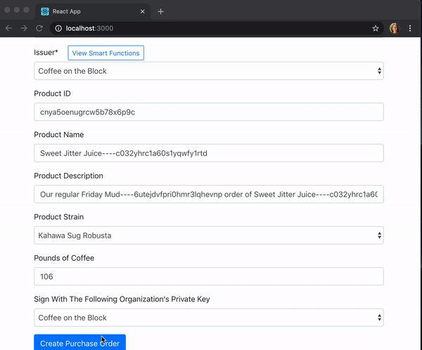
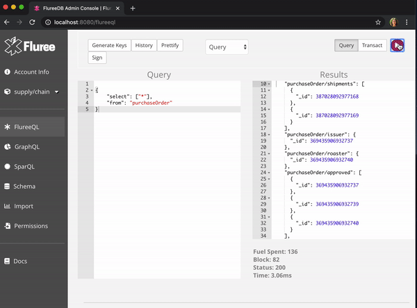
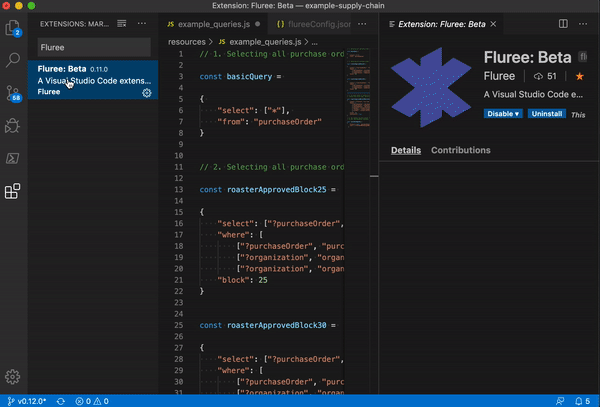

## Supply Chain

This Github repo demonstrates a coffee supply chain application backed by Fluree. The application follows a purchase order as it goes from the grower to the roaster to the cafe. 

The infrastucture for this example is simple:
- Fluree server 
- Thin, React layer

This use case demonstrates Fluree smart functions, or in other words how data protects itself. 

Features demonstrated: `smart functions`. 



### Get Started

1. `Start Fluree`

Download and unzip this [Fluree packet](https://fluree-examples.s3.amazonaws.com/supply-chain-packet.zip). The packet contains Fluree, version 0.13.0, as well as a prepopulated database with the schema, seed data, smart functions, and purchase orders (you can find these transactions in `resources/`).

Navigate to the folder where you downloaded the packet, and run `./fluree_start.sh`. If you have Java 8+ installed, this should launch Fluree, and a Admin Console will be available for you to explore at `http://localhost:8080`. `resources/example_queries.js` has example queries you can test out directly in the Admin Console.

2. `Start the App`

```
git clone https://github.com/fluree/example-supply-chain.git
```

```
cd example-supply-chain
```

```
npm install
```

```
npm start
```

### How Does it Work

Smart functions in Fluree govern what information can be updated and transacted in Fluree. Smart functions can be applied at different locations:

- `For an Individual` - You can apply smart functions to a given auth record. This means that whenever that auth record does anything, certain rules apply. Those rules won't apply to other users (unless their auth records have the same rules).

- `Across the Board` -  Smart functions can also be applied at the collection or predicate level. This means that any time * anyone * tries to add, update, or delete a subject in a collection or a subject with a given predicate, certain rules apply. 

If a certain transaction triggers `individual` smart functions, due to the auth record that issued it, AND `across the board` smart functions due to the subjects it is updating, ALL relevant smart functions are applied. 

In this example, all auth records have root access. This means, by default, any participant can view or update anything. However, on top of that, we layer smart functions that apply across the board. Just because rules are applied across the board, DOESN'T mean that everyone has the same access. Many of the smart functions in this example use the `relationship?` function, which returns `true` if a certain relationship is present, or `false` otherwise.

#### Example Smart Functions: `purchaseOrder/closed`

We'll look at just one predicate as an example - `purchaseOrder/closed`. The `purchaseOrder/closed` predicate references an organization. Think of this predicate as the digital equivalent of an organization printing its name at the bottom of a paper form. We want to make sure that the name being printed matches the signature, and that you are only printing your own name. To that effect, the `purchaseOrder/closed` predicate has three smart functions:

Smart Function | Code | Explanation
--- | --- | ---
`orgAuthIsSelf` | `(relationship? (?o) [\"organization/auth\"] (?auth_id))` | The organization in `purchaseOrder/closed` has to match the `?auth_id` signing this transaction. 
`didAuthReceiveShipment?` | `(relationship? (?sid) [\"purchaseOrder/shipments\" \"shipment/receivedSignature\" \"organization/auth\"] (?auth_id))` | The organization in `purchaseOrder/closed` has to have received this shipment before it can closed the purchase order.* This is one of the smart functions that enforces a chain of provenance. 
`authIsCafe?` | `(relationship? (?auth_id) [\"organization/_auth\" \"organization/type\"] [\"_tag/id\", \"organization/type:cafe\"])` | Finally, the only a cafe can close a purchase order. 

\* A more robust example would include features like cancelled purchase orders, but that is not included in this simplified demo. 

As you are trying out the demo yourself, you can click on the "View Smart Funcions" buttons throughout the application to see which smart functions apply to that predicate and collection. For example, when you click, `purchaseOrder/closed`, you will see both the smart functions that apply to the `purchaseOrder/closed` predicate AND the `purchaseOrder` collection. 

#### Example Queries

There are other example queries that you can try out in `/resources/example_queries.js`.



#### Visual Studio Code

If you are using Visual Studio Code to view this repo, you can issue the example queries using the extension. 

1. Download the `Fluree: Beta` extension. In the top menu bar, select `View` > `Extensions`. Then search `Fluree: Beta` and click install.
2. Open the Command Palette by going to `View` > `Command Palette`, and issue `Fluree: Set Config`. 
3. Highlight any query in `resources/example_queries.js`, using the Command Palette, issue, `Fluree: Query`, and the results of the query will appear in a `flureeResponse.txt` file. Note: every time you issue a query or transaction, this file gets overwritten.



### Resources

To see more example projects, visit our [developer hub repo](https://github.com/fluree/developer-hub). 


Check out our entire [documentation](https://docs.flur.ee/) or jump directly to the section on [smart functions](https://docs.flur.ee/docs/smart-functions).

You can also engage with us via email, `support@flur.ee`.

Or by [Slack](https://launchpass.com/flureedb).


